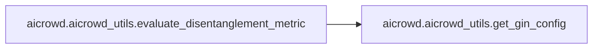

# Aicrowd Aicrowd Utils

[_Documentation generated by Documatic_](https://www.documatic.com)

<!---Documatic-section-Codebase Structure-start--->
## Codebase Structure

<!---Documatic-block-system_architecture-start--->
```mermaid
None
```
<!---Documatic-block-system_architecture-end--->

# #
<!---Documatic-section-Codebase Structure-end--->

<!---Documatic-section-aicrowd.aicrowd_utils.is_on_aicrowd_server-start--->
## aicrowd.aicrowd_utils.is_on_aicrowd_server

<!---Documatic-section-is_on_aicrowd_server-start--->
<!---Documatic-block-aicrowd.aicrowd_utils.is_on_aicrowd_server-start--->
<details>
	<summary><code>aicrowd.aicrowd_utils.is_on_aicrowd_server</code> code snippet</summary>

```python
def is_on_aicrowd_server():
    on_aicrowd_server = os.getenv('AICROWD_IS_GRADING', False)
    on_aicrowd_server = True if on_aicrowd_server != False else on_aicrowd_server
    return on_aicrowd_server
```
</details>
<!---Documatic-block-aicrowd.aicrowd_utils.is_on_aicrowd_server-end--->
<!---Documatic-section-is_on_aicrowd_server-end--->

# #
<!---Documatic-section-aicrowd.aicrowd_utils.is_on_aicrowd_server-end--->

<!---Documatic-section-aicrowd.aicrowd_utils.get_gin_config-start--->
## aicrowd.aicrowd_utils.get_gin_config

<!---Documatic-section-get_gin_config-start--->
<!---Documatic-block-aicrowd.aicrowd_utils.get_gin_config-start--->
<details>
	<summary><code>aicrowd.aicrowd_utils.get_gin_config</code> code snippet</summary>

```python
def get_gin_config(config_files, metric_name):
    for gin_eval_config in config_files:
        metric_name_of_config = gin_eval_config.split('/')[-1].replace('.gin', '')
        if metric_name == metric_name_of_config:
            return gin_eval_config
    return None
```
</details>
<!---Documatic-block-aicrowd.aicrowd_utils.get_gin_config-end--->
<!---Documatic-section-get_gin_config-end--->

# #
<!---Documatic-section-aicrowd.aicrowd_utils.get_gin_config-end--->

<!---Documatic-section-aicrowd.aicrowd_utils.evaluate_disentanglement_metric-start--->
## aicrowd.aicrowd_utils.evaluate_disentanglement_metric

<!---Documatic-section-evaluate_disentanglement_metric-start--->


### Object Calls

* aicrowd.aicrowd_utils.get_gin_config

<!---Documatic-block-aicrowd.aicrowd_utils.evaluate_disentanglement_metric-start--->
<details>
	<summary><code>aicrowd.aicrowd_utils.evaluate_disentanglement_metric</code> code snippet</summary>

```python
def evaluate_disentanglement_metric(model, metric_names=['mig'], dataset_name='mpi3d_toy'):
    from aicrowd import utils_pytorch
    from aicrowd.evaluate import evaluate
    from disentanglement_lib.config.unsupervised_study_v1 import sweep as unsupervised_study_v1
    _study = unsupervised_study_v1.UnsupervisedStudyV1()
    evaluation_configs = sorted(_study.get_eval_config_files())
    evaluation_configs.append(os.path.join(os.getenv('PWD', ''), 'extra_metrics_configs/irs.gin'))
    results_dict_all = dict()
    for metric_name in metric_names:
        eval_bindings = ['evaluation.random_seed = {}'.format(0), "evaluation.name = '{}'".format(metric_name)]
        my_config = get_gin_config(evaluation_configs, metric_name)
        if my_config is None:
            logging.warning('metric {} not among available configs: {}'.format(metric_name, evaluation_configs))
            return 0
        gin.parse_config_files_and_bindings([my_config], eval_bindings)
        model_path = os.path.join(model.ckpt_dir, 'pytorch_model.pt')
        utils_pytorch.export_model(utils_pytorch.RepresentationExtractor(model.model.encoder, 'mean'), input_shape=(1, model.num_channels, model.image_size, model.image_size), path=model_path)
        output_dir = os.path.join(model.ckpt_dir, 'eval_results', metric_name)
        os.makedirs(os.path.join(model.ckpt_dir, 'results'), exist_ok=True)
        results_dict = evaluate(model.ckpt_dir, output_dir, True)
        gin.clear_config()
        results = 0
        for (key, value) in results_dict.items():
            if key != 'elapsed_time' and key != 'uuid' and (key != 'num_active_dims'):
                results = value
        logging.info('Evaluation   {}={}'.format(metric_name, results))
        results_dict_all['eval_{}'.format(metric_name)] = results
    return results_dict_all
```
</details>
<!---Documatic-block-aicrowd.aicrowd_utils.evaluate_disentanglement_metric-end--->
<!---Documatic-section-evaluate_disentanglement_metric-end--->

# #
<!---Documatic-section-aicrowd.aicrowd_utils.evaluate_disentanglement_metric-end--->

[_Documentation generated by Documatic_](https://www.documatic.com)