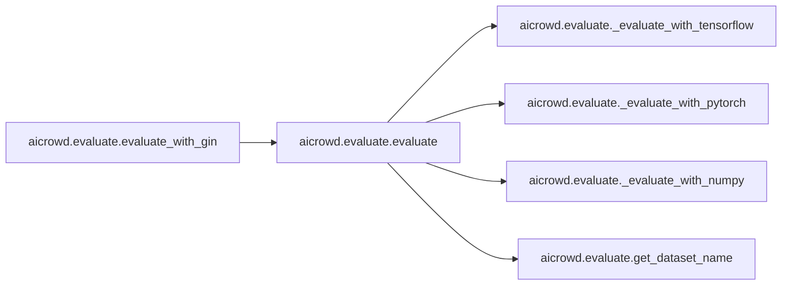
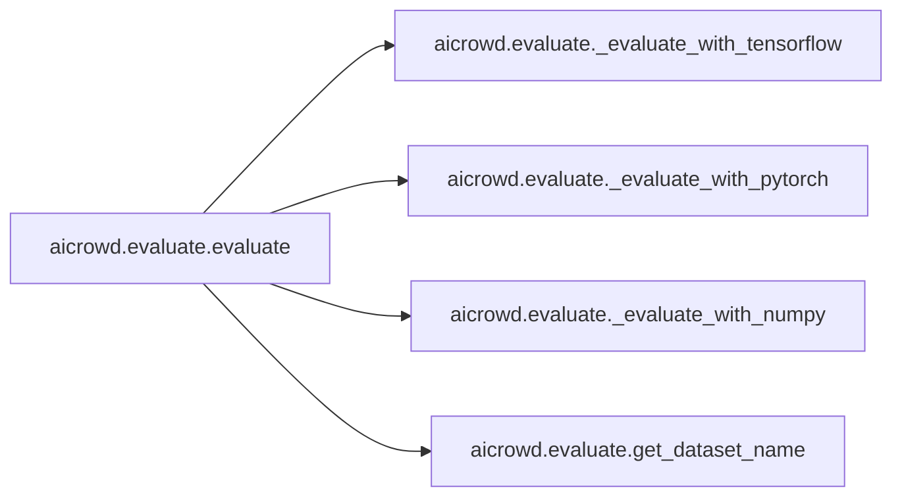

# Aicrowd Evaluate

[_Documentation generated by Documatic_](https://www.documatic.com)

<!---Documatic-section-Codebase Structure-start--->
## Codebase Structure

<!---Documatic-block-system_architecture-start--->
```mermaid
None
```
<!---Documatic-block-system_architecture-end--->

# #
<!---Documatic-section-Codebase Structure-end--->

<!---Documatic-section-aicrowd.evaluate.get_dataset_name-start--->
## [aicrowd.evaluate.get_dataset_name](4-aicrowd_evaluate.md#aicrowd.evaluate.get_dataset_name)

<!---Documatic-section-get_dataset_name-start--->
<!---Documatic-block-aicrowd.evaluate.get_dataset_name-start--->
<details>
	<summary><code>aicrowd.evaluate.get_dataset_name</code> code snippet</summary>

```python
def get_dataset_name():
    return os.getenv('AICROWD_DATASET_NAME', 'cars3d')
```
</details>
<!---Documatic-block-aicrowd.evaluate.get_dataset_name-end--->
<!---Documatic-section-get_dataset_name-end--->

# #
<!---Documatic-section-aicrowd.evaluate.get_dataset_name-end--->

<!---Documatic-section-aicrowd.evaluate.evaluate_with_gin-start--->
## [aicrowd.evaluate.evaluate_with_gin](4-aicrowd_evaluate.md#aicrowd.evaluate.evaluate_with_gin)

<!---Documatic-section-evaluate_with_gin-start--->


### Object Calls

* [aicrowd.evaluate.evaluate](4-aicrowd_evaluate.md#aicrowd.evaluate.evaluate)

<!---Documatic-block-aicrowd.evaluate.evaluate_with_gin-start--->
<details>
	<summary><code>aicrowd.evaluate.evaluate_with_gin</code> code snippet</summary>

```python
def evaluate_with_gin(model_dir, output_dir, overwrite=False, gin_config_files=None, gin_bindings=None):
    if gin_config_files is None:
        gin_config_files = []
    if gin_bindings is None:
        gin_bindings = []
    gin.parse_config_files_and_bindings(gin_config_files, gin_bindings)
    evaluate(model_dir, output_dir, overwrite)
    gin.clear_config()
```
</details>
<!---Documatic-block-aicrowd.evaluate.evaluate_with_gin-end--->
<!---Documatic-section-evaluate_with_gin-end--->

# #
<!---Documatic-section-aicrowd.evaluate.evaluate_with_gin-end--->

<!---Documatic-section-aicrowd.evaluate.evaluate-start--->
## [aicrowd.evaluate.evaluate](4-aicrowd_evaluate.md#aicrowd.evaluate.evaluate)

<!---Documatic-section-evaluate-start--->


### Object Calls

* [aicrowd.evaluate._evaluate_with_tensorflow](4-aicrowd_evaluate.md#aicrowd.evaluate._evaluate_with_tensorflow)
* [aicrowd.evaluate._evaluate_with_pytorch](4-aicrowd_evaluate.md#aicrowd.evaluate._evaluate_with_pytorch)
* [aicrowd.evaluate._evaluate_with_numpy](4-aicrowd_evaluate.md#aicrowd.evaluate._evaluate_with_numpy)
* [aicrowd.evaluate.get_dataset_name](4-aicrowd_evaluate.md#aicrowd.evaluate.get_dataset_name)

<!---Documatic-block-aicrowd.evaluate.evaluate-start--->
<details>
	<summary><code>aicrowd.evaluate.evaluate</code> code snippet</summary>

```python
@gin.configurable('evaluation', blacklist=['model_dir', 'output_dir', 'overwrite'])
def evaluate(model_dir, output_dir, overwrite=False, evaluation_fn=gin.REQUIRED, random_seed=gin.REQUIRED, name=''):
    del name
    if tf.gfile.IsDirectory(output_dir):
        if overwrite:
            tf.gfile.DeleteRecursively(output_dir)
        else:
            raise ValueError('Directory already exists and overwrite is False.')
    experiment_timer = time.time()
    try:
        if gin.query_parameter('dataset.name') == 'auto':
            gin_config_file = os.path.join(model_dir, 'results', 'gin', 'postprocess.gin')
            gin_dict = results.gin_dict(gin_config_file)
            with gin.unlock_config():
                gin.bind_parameter('dataset.name', gin_dict['dataset.name'].replace("'", ''))
        dataset = named_data.get_named_ground_truth_data()
    except NotFoundError:
        if gin.query_parameter('dataset.name') == 'auto':
            with gin.unlock_config():
                gin.bind_parameter('dataset.name', get_dataset_name())
        dataset = named_data.get_named_ground_truth_data()
    if os.path.exists(os.path.join(model_dir, 'tfhub')):
        module_path = os.path.join(model_dir, 'tfhub')
        results_dict = _evaluate_with_tensorflow(module_path, evaluation_fn, dataset, random_seed)
    elif os.path.exists(os.path.join(model_dir, 'pytorch_model.pt')):
        module_path = os.path.join(model_dir, 'pytorch_model.pt')
        results_dict = _evaluate_with_pytorch(module_path, evaluation_fn, dataset, random_seed)
    elif os.path.exists(os.path.join(model_dir, 'python_model.dill')):
        module_path = os.path.join(model_dir, 'python_model.dill')
        results_dict = _evaluate_with_numpy(module_path, evaluation_fn, dataset, random_seed)
    else:
        raise RuntimeError('`model_dir` must contain either a pytorch or a TFHub model.')
    original_results_dir = os.path.join(model_dir, 'results')
    results_dir = os.path.join(output_dir, 'results')
    results_dict['elapsed_time'] = time.time() - experiment_timer
    results.update_result_directory(results_dir, 'evaluation', results_dict, original_results_dir)
    return results_dict
```
</details>
<!---Documatic-block-aicrowd.evaluate.evaluate-end--->
<!---Documatic-section-evaluate-end--->

# #
<!---Documatic-section-aicrowd.evaluate.evaluate-end--->

<!---Documatic-section-aicrowd.evaluate._evaluate_with_tensorflow-start--->
## [aicrowd.evaluate._evaluate_with_tensorflow](4-aicrowd_evaluate.md#aicrowd.evaluate._evaluate_with_tensorflow)

<!---Documatic-section-_evaluate_with_tensorflow-start--->
<!---Documatic-block-aicrowd.evaluate._evaluate_with_tensorflow-start--->
<details>
	<summary><code>aicrowd.evaluate._evaluate_with_tensorflow</code> code snippet</summary>

```python
def _evaluate_with_tensorflow(module_path, evaluation_fn, dataset, random_seed):
    with hub.eval_function_for_module(module_path) as f:

        def _representation_function(x):
            """Computes representation vector for input images."""
            output = f(dict(images=x), signature='representation', as_dict=True)
            return np.array(output['default'])
        results_dict = evaluation_fn(dataset, _representation_function, random_state=np.random.RandomState(random_seed))
    return results_dict
```
</details>
<!---Documatic-block-aicrowd.evaluate._evaluate_with_tensorflow-end--->
<!---Documatic-section-_evaluate_with_tensorflow-end--->

# #
<!---Documatic-section-aicrowd.evaluate._evaluate_with_tensorflow-end--->

<!---Documatic-section-aicrowd.evaluate._evaluate_with_pytorch-start--->
## [aicrowd.evaluate._evaluate_with_pytorch](4-aicrowd_evaluate.md#aicrowd.evaluate._evaluate_with_pytorch)

<!---Documatic-section-_evaluate_with_pytorch-start--->
<!---Documatic-block-aicrowd.evaluate._evaluate_with_pytorch-start--->
<details>
	<summary><code>aicrowd.evaluate._evaluate_with_pytorch</code> code snippet</summary>

```python
def _evaluate_with_pytorch(module_path, evalulation_fn, dataset, random_seed):
    from aicrowd import utils_pytorch
    model = utils_pytorch.import_model(path=module_path)
    _representation_function = utils_pytorch.make_representor(model)
    results_dict = evalulation_fn(dataset, _representation_function, random_state=np.random.RandomState(random_seed))
    return results_dict
```
</details>
<!---Documatic-block-aicrowd.evaluate._evaluate_with_pytorch-end--->
<!---Documatic-section-_evaluate_with_pytorch-end--->

# #
<!---Documatic-section-aicrowd.evaluate._evaluate_with_pytorch-end--->

<!---Documatic-section-aicrowd.evaluate._evaluate_with_numpy-start--->
## [aicrowd.evaluate._evaluate_with_numpy](4-aicrowd_evaluate.md#aicrowd.evaluate._evaluate_with_numpy)

<!---Documatic-section-_evaluate_with_numpy-start--->
<!---Documatic-block-aicrowd.evaluate._evaluate_with_numpy-start--->
<details>
	<summary><code>aicrowd.evaluate._evaluate_with_numpy</code> code snippet</summary>

```python
def _evaluate_with_numpy(module_path, evalulation_fn, dataset, random_seed):
    import utils_numpy
    fn = utils_numpy.import_function(path=module_path)
    _representation_function = utils_numpy.make_representor(fn)
    results_dict = evalulation_fn(dataset, _representation_function, random_state=np.random.RandomState(random_seed))
    return results_dict
```
</details>
<!---Documatic-block-aicrowd.evaluate._evaluate_with_numpy-end--->
<!---Documatic-section-_evaluate_with_numpy-end--->

# #
<!---Documatic-section-aicrowd.evaluate._evaluate_with_numpy-end--->

[_Documentation generated by Documatic_](https://www.documatic.com)